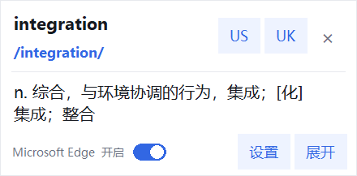

# 大声发划词翻译

> 划一下就翻译，点一下就发音。一个面向 Windows 的轻量、离线、按应用启用的划词翻译工具。

**作者：眼泪斷了线**

当前版本：`0.3.2` · Windows 10/11 · 本地翻译 · 无需 API Key


## 为什么做它

查一个单词不应该打断阅读。大声发划词翻译常驻系统托盘，在你允许的 Word、浏览器、PDF 阅读器或其他应用中，双击单词或拖动选择句子后，立即在鼠标附近给出音标、标准美音/英音和直译。

翻译词典和中英双向模型随软件安装并在本机运行。没有账号、没有 API Key，也不会把选中的文档内容发送到翻译网站。

## 核心功能

| 功能 | 说明 |
| --- | --- |
| 发音优先 | 音标与 US/UK 发音位于界面上方，单词和英文句子都能朗读。 |
| 迷你浮窗 | 靠近鼠标出现；高度随直译自动调整，点窗口外任意位置立即收起。 |
| 完整大窗口 | 发音、原文、直译、复制和手动编辑集中展示，按钮不会被内容挤掉。 |
| 按应用启用 | 常用应用优先；其他应用可批量开关、单独设置或提升为常用。 |
| 系统托盘 | 右键图标即可切换窗口模式、暂停取词、打开设置或退出。 |
| 完全离线 | ECDICT 负责单词，OPUS/CTranslate2 负责句子，中英双向均在本机完成。 |
| 多应用取词 | PowerPoint 使用专用选区读取；微信等自绘应用失败时自动走延时兼容读取。 |
| 剪贴板保护 | 兼容读取前保存完整剪贴板对象；焦点或剪贴板被其他操作改变时立即取消。 |



## 下载与安装

1. 前往 [Releases](https://github.com/bwai0640-arch/dashengfa-translator/releases/latest) 下载 `DaShengFaTranslator-0.3.2-Windows-x64.zip`。
2. 完整解压 ZIP，不要只单独复制 EXE。
3. 双击 `安装.cmd`。
4. 安装完成后，软件会安静进入 Windows 系统托盘。

软件无需安装 Python、Docker 或翻译插件。

## 使用方法

1. 右键托盘中的“声”图标，打开“应用设置”。
2. 打开需要使用划词翻译的应用开关。
3. 双击英文单词，或拖动选择短语与句子。
4. 在迷你窗点击 `US` / `UK` 播放美音或英音。
5. 需要更多空间时点击“展开”，进入大窗口。

迷你窗中的“当前应用”开关可直接停用当前软件；单击迷你窗外任意区域即可关闭本次浮窗。

## 应用范围管理

- Word、WPS、Edge、Chrome、Firefox、Acrobat 与记事本默认位于常用应用区。
- 调整过的应用会优先排列。
- “其他应用”支持一键全部开启或关闭，也可以展开后逐项设置。
- 任意其他应用都可以提升到常用区。
- 未运行的程序可通过“添加应用…”手动选择 EXE。

## 隐私与安全边界

- 文档选区不会上传到在线翻译服务。
- 程序不会读取密码输入框。
- 兼容读取会短暂保存并还原原剪贴板；无法安全保存时不会发送复制快捷键。
- 取词等待期间如果焦点或剪贴板被其他操作改变，软件会取消本次读取，不覆盖新内容。
- 设置、日志和翻译缓存位于 `%LOCALAPPDATA%\DaShengFaTranslator`。
- 从 `0.2.x` 升级时，软件会复制旧目录中的设置与翻译缓存，不删除旧数据。

## 技术路线

```text
鼠标双击 / 拖选
        ↓
应用白名单检查
        ↓
Word / PowerPoint 专用读取 → Windows UI Automation → 安全剪贴板兼容读取
        ↓
ECDICT 单词查询 / OPUS 本地句子翻译
        ↓
迷你浮窗或大窗口 + Windows SAPI 英美发音
```

详细设计见 [docs/ARCHITECTURE.md](docs/ARCHITECTURE.md)。构建与发布步骤见 [docs/RELEASE.md](docs/RELEASE.md)。

## 本地开发

要求：Windows 10/11、Python 3.12。

```powershell
python -m pip install -r requirements-runtime.txt
python desktop_app.py
```

构建无需 Python 的 Windows 文件夹版：

```powershell
python -m PyInstaller --noconfirm --clean `
  --distpath dist-desktop `
  --workpath build-desktop `
  DaShengFaTranslator.spec
```

发布前至少运行：

```powershell
python -m py_compile desktop_app.py selection_capture.py app.py
python -m unittest discover -s tests -v
```

## 项目结构

| 路径 | 用途 |
| --- | --- |
| `desktop_app.py` | 桌面版入口、托盘、全局取词、界面和应用设置。 |
| `selection_capture.py` | PowerPoint、UI Automation 与安全剪贴板兼容读取。 |
| `app.py` | 本地词典、OPUS/CTranslate2 翻译、SAPI 发音和 Word 读取核心。 |
| `resources/` | ECDICT 数据库、双向翻译模型和程序图标。 |
| `DaShengFaTranslator.spec` | PyInstaller 打包配置。 |
| `docs/` | 架构、发布和产品截图。 |
| `tests/` | 不操作真实桌面和剪贴板的取词回归测试。 |

## 作者与许可

大声发划词翻译由 **眼泪斷了线** 制作。

仓库暂未声明统一的开源许可。除第三方组件按各自许可证使用外，项目代码与品牌权利由作者保留。第三方组件与数据来源见 [THIRD_PARTY_NOTICES.md](THIRD_PARTY_NOTICES.md)。

安全问题请通过 GitHub 的 Private vulnerability reporting 提交，参见 [SECURITY.md](SECURITY.md)。
